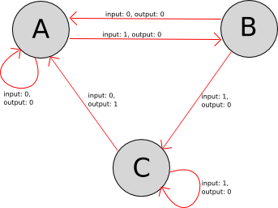

<details open><summary>Info</summary><p>

* **Did you know that C++20 introduced coroutines?** (co__await)

  * https://eel.is/c++draft/dcl.fct.def.coroutine#def:coroutine

</p></details><details open><summary>Example</summary><p>

```cpp
struct task {
  struct promise_type {
    task get_return_object() { return {}; }
    std::suspend_never initial_suspend() { return {}; }
    std::suspend_never final_suspend() noexcept { return {}; }
    template<class T> void return_value(T) {}
    void unhandled_exception() {}
  };
};

template<class T>
class awaiter {
 public:
  auto operator co_await() {
    struct {
      awaiter& aw;

      auto await_ready() const noexcept -> bool { return aw.value; }
      auto await_suspend(std::coroutine_handle<> coroutine) noexcept {
        aw.coroutine = coroutine;
        return true;
      }

      auto await_resume() const noexcept {
        struct reset {
          T& value;
          ~reset() { value = {}; }
        } _{aw.value};
        return aw.value;
      }
    } awaiter{*this};

    return awaiter;
  }

  void process(const T& value) {
    this->value = value;
    coroutine.resume();
  }

 private:
  T value{};
  std::coroutine_handle<> coroutine{};
};

int main() {
    auto input = awaiter<int>{};
    auto sum = 0;

    const auto await_sum = [](auto& input, auto& sum) -> task {
      for (;;) {
        sum += co_await input;
      }
    };

    [[maybe_unused]] auto _ = await_sum(input, sum);
    input.process(1);
    assert(1 == sum);

    input.process(42);
    assert(43 == sum);

    input.process(-10);
    assert(33 == sum);
}
```

> https://godbolt.org/z/fo4j1Mn8Y

</p></details><details open><summary>Puzzle</summary><p>

* **Can you implement a simple parser using co_await?**

  * Naive implementation: https://godbolt.org/z/Mjcj3jbva

  

```cpp
class parser {
 public:
  explicit parser(std::stringstream& out) : out{out} { }

  void parse(std::string_view in) {
    for (const auto value : in) {
       input.process(value);
    }
  }

 private:
  task parse_impl() {
    // TODO
  }

  awaiter<char> input{};
  task start{parse_impl()};
  std::stringstream& out;
};

int main() {
  {
    std::stringstream out{};
    parser p{out};
    p.parse("0");
    assert("0" == out.str());
  }

  {
    std::stringstream out{};
    parser p{out};
    p.parse("01");
    assert("00" == out.str());
  }

  {
    std::stringstream out{};
    parser p{out};
    p.parse("0110");
    assert("0001" == out.str());
  }

  {
    std::stringstream out{};
    parser p{out};
    p.parse("0001");
    assert("0000" == out.str());
  }

  {
    std::stringstream out{};
    parser p{out};
    p.parse("000110");
    assert("000001" == out.str());
  }

  {
    std::stringstream out{};
    parser p{out};
    p.parse("0110100010010001101001000111110010011001");
    assert("0001000000000000010000000000001000000100" == out.str());
  }
}
```

> https://godbolt.org/z/6cxdqEno1
